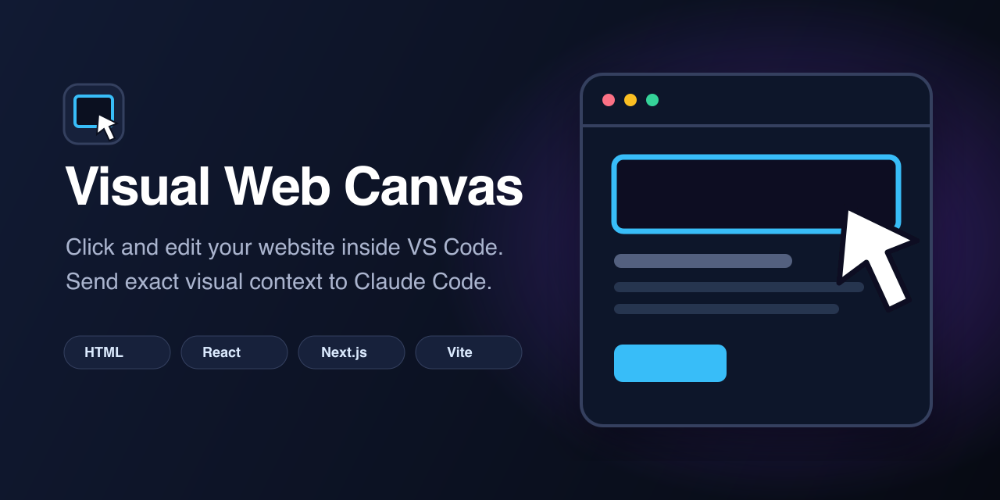

# Visual Web Canvas



Click and edit your website inside VS Code. Select an element, leave a visual comment, and the exact DOM, source location, React component stack, computed styles, viewport, and cropped screenshot are supplied to your existing Claude Code conversation.

No second chat box. No screenshot-and-guess loop. No cloud account or telemetry.

> Visual Web Canvas is independent open-source software and is not affiliated with or endorsed by Anthropic.

## Install

```sh
npx --yes visual-web-canvas@latest install
```

Until the first Marketplace release, install the VSIX from [GitHub Releases](https://github.com/rileyvibecodes/visual-web-canvas/releases), then run **Visual Web Canvas: Install/Repair Claude Bridge** from the Command Palette.

Requirements:

- VS Code 1.94+ for the complete Claude Code workflow.
- Node.js 20+ for the installer and live React source editor.
- Claude Code for VS Code for seamless chat context.
- Cursor 3.6+ is available as a clearly labeled MCP-based beta.

## Two canvas modes

| Capability | Static HTML | React / Vite / Next.js | Generic dev server |
| --- | --- | --- | --- |
| Exact responsive viewport | Yes | Yes | Yes |
| Element/source context | Exact HTML ranges | React Fiber + source stack | Runtime DOM |
| Inline copy editing | Yes | Yes, through React Rewrite | Comment to agent |
| Visual style editing | CSS + responsive overrides | Tailwind 3/4, staged | Preview/comment |
| Duplicate/delete/reorder | Yes | Yes, staged | Comment to agent |
| Claude Code context bridge | Yes | Yes | Yes |
| Comment screenshot | Yes | Yes | Yes |

### Static HTML

Open any `.html` file and run **Visual Web Canvas: Open HTML Canvas**. The preview is generated from the open `TextDocument`, including unsaved changes.

- Click to select; double-click text to edit it.
- Edit layout, typography, color, radius, and opacity from the inspector.
- Apply styles globally or at desktop, tablet, and mobile breakpoints.
- Duplicate or delete elements with normal VS Code undo support.
- Compare against a simultaneous 390 px mobile canvas.
- Show a 768 px fold guide and inspect/revert the previous document state.

Authored page scripts are disabled in static mode. Source identifiers exist only in the rendered preview and never modify the saved HTML.

### React, Vite, and Next.js

Start the app normally, then run **Visual Web Canvas: Connect Dev Server** and enter its loopback URL.

The extension launches the MIT-licensed React Rewrite bridge behind a second tokenized proxy. This provides staged visual source editing while preserving Vite/Next HMR and Remote SSH forwarding.

- **Inspect** captures an element for Claude and opens its source location.
- **Design** enables React Rewrite's text, Tailwind, resize, move, duplicate, delete, multi-select, and change-review tools.
- If React/source resolution is unavailable, the same canvas falls back to safe inspect/comment mode instead of guessing at source writes.

Only `localhost`, `127.0.0.1`, and `::1` dev servers are accepted.

## The Claude workflow

1. Select an element in either canvas mode.
2. Click **Comment → Claude** and write the visual change you want.
3. Visual Web Canvas captures a cropped screenshot and focuses the existing Claude Code chat.
4. Type naturally— even `do this` is enough. On submit, the `UserPromptSubmit` hook adds the selected element and comment as private context.
5. Claude edits the real source. The canvas refreshes through VS Code or HMR.

The bridge is additive: it preserves every existing Claude hook. Install, repair, diagnose, and remove it with:

```sh
visual-web-canvas doctor
visual-web-canvas uninstall --keep-extension
```

## Responsive canvas

Desktop means 1440 CSS pixels even when the editor pane is narrower. The canvas scales visually to fit while keeping the real iframe viewport fixed, so media queries do not accidentally follow the size of the VS Code window.

Presets: responsive, 1440 desktop, 1024 laptop, 768 tablet, and 390 mobile.

## Cursor beta

```sh
npx --yes visual-web-canvas@latest install --cursor
```

Cursor currently lacks a supported equivalent to Claude Code's dynamic `UserPromptSubmit.additionalContext`. The beta therefore installs a local MCP server with:

- `get_current_selection`
- `get_pending_comments`
- `get_screenshot`
- `mark_comment_resolved`

The canvas works inside Cursor, but context retrieval depends on the Cursor agent calling the MCP tool. We do not market this as identical to the Claude Code bridge.

## Privacy and security

- No telemetry, account, hosted relay, or remote service.
- Selection state is stored with private permissions under `~/.visual-web-canvas/state/`.
- Screenshots are captured only after a visual comment and stored under `~/.visual-web-canvas/screenshots/`.
- Closing a canvas removes its active state file.
- Static previews use a restrictive CSP, disable page-authored scripts, block forms and frames, and only serve workspace-local assets.
- Live mode accepts loopback targets only and uses random per-session tokens.
- Source paths must resolve inside the open workspace before they can be opened or edited.

See [SECURITY.md](SECURITY.md) for reporting and the complete trust model.

## Development

```sh
npm install
npm run check
npm run package
```

The repo includes unit and integration coverage for HTML/source mapping, document edits, Claude hook context, exact viewport math, static preview isolation, live proxy injection, and path traversal.

Read [docs/ARCHITECTURE.md](docs/ARCHITECTURE.md), [CONTRIBUTING.md](CONTRIBUTING.md), and [THIRD_PARTY_NOTICES.md](THIRD_PARTY_NOTICES.md) before changing the bridge or source-editing layers.

## License

[MIT](LICENSE)
